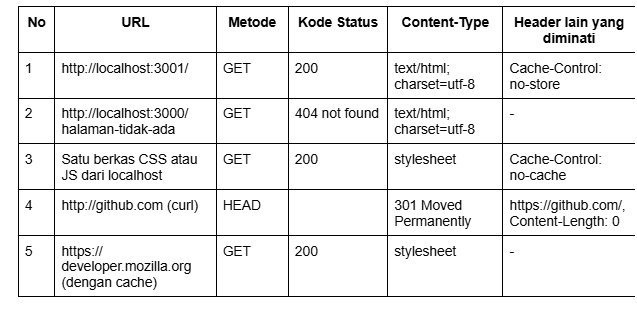
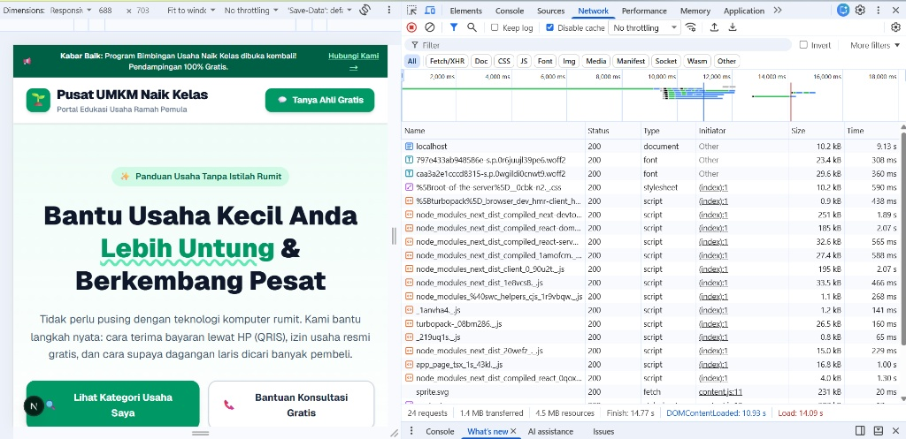
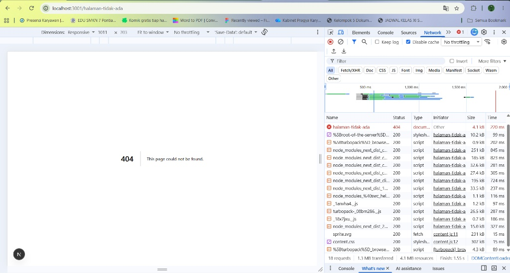
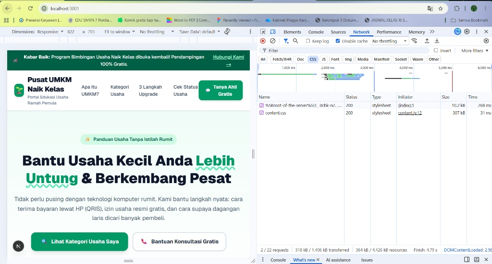
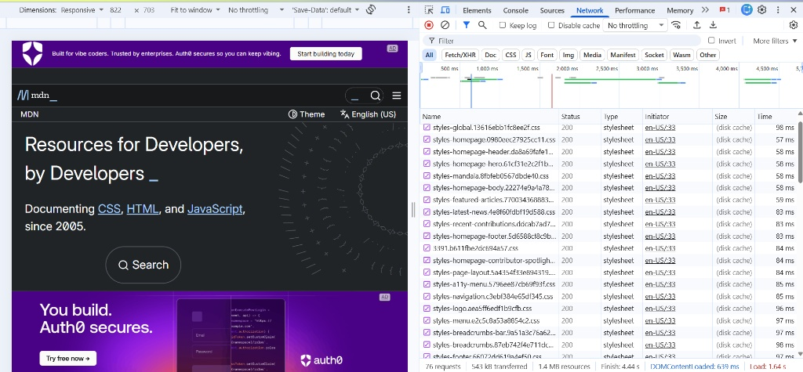
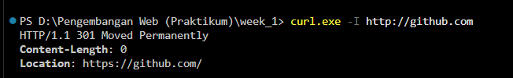
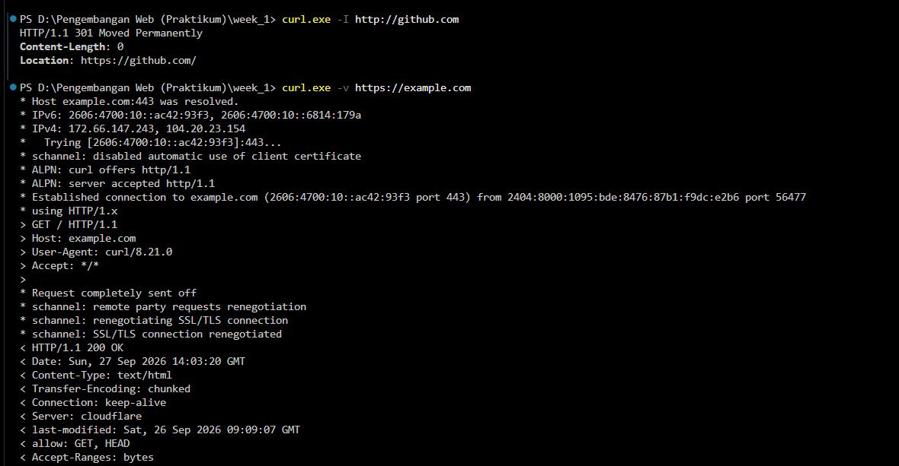

## Nama: Alifa Fatin Ramadhani
## NIM: 105224019
docs/praktikum/modul-01.md
# Dokumen Teknis Modul 1 — Lingkungan Pengembangan, Git, dan Lalu Lintas
## HTTP
Nama/NIM : Alifa Fatin Ramadhani - 105224019
Repository :https://github.com/alifafatin/week-1_PraktikumPAW
- Lingkungan Pengembangan Tabel versi sistem operasi, Node.js, npm, Git, dan Visual
## Studio Code.

## Perangkat Versi
OS Windows 11
Node.Js v22.14.0
## NPM 10.9.2
## Git 2.38.0.windows.1
Vs Code 1.139.1 (user setup)

- Alur Kerja Git- Keluaran git log --oneline --graph
dffeaee (HEAD -> docs/readme-lengkap, origin/main, main) web umkm

- Tautan pull request yang telah digabungkan
https://github.com/alifafatin/week-1_PraktikumPAW/pull/1

- Konflik yang terjadi, cara penyelesaian, dan alasan pemilihan isi akhir
tidak ada

##3 Pengamatan Lalu Lintas HTTP
- Lembar kerja pengamatan (Tabel 9) beserta tangkapan layar DevTools

- http://localhost:3001/

- http://localhost:3000/ halaman-tidak-ada

- Satu berkas CSS atau JS dari localhost

- https:// developer.mozilla.org (dengan cache)

- http://github.com (curl)

- Keluaran curl -I dan curl -v

- Analisis: perbedaan status dan ukuran antara pemuatan dengan dan tanpa
cache, alasan metode curl -I adalah HEAD, dan alasan http://github.com dialihkan
> Jika dilihat tanpa cache, maka akan mengirimkan permintaan penuh ke server asal.
dengan cache akan dimanfaatkan salinan berkas lokal di perangkat.
> alasan curl -i adalah head karena pada perintah curl itu sendiri berfungsi untuk meminta
informasi kepada header dari server tanpa minta isi body.
> http://github.com, menggunakan protokol HTTP biasa yang tidak terenkripsi untuk menjaga
keamanan data, enkripsi komunikasi, dan privasi pengguna, GitHub secara otomatis
mengalihkan (redirect) seluruh lalu lintas HTTP ke versi HTTPS yang terenkripsi.

- Kendala dan Penyelesaian
- tidak ada
## -
- Catatan Pemanfaatan AI
Penggunaan Ai digunakan dalam pembuatan tampilan web dengan prompting
“you are a frontend developer, create a simple interface for page.tsx

the rules, the website is about MSME (Micro Small and Medium Enterprises) website to help
people have small business to upgrade. The homepage is simple but  easy to understand to
people who not really can using technology. and on the page have a details of MSME

The output needs to be a single file after it is finished.”
